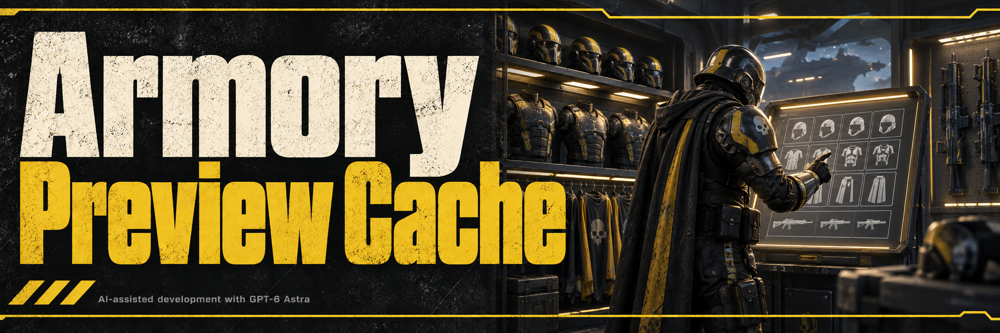

The UI repair updates the screen stack, controller IDs and UI world fields. Live read-only checks resolve the ship Armory and loadout equipment queues, with 15 visible thumbnail widgets on each. Cache mutations and frame-time behavior still need in-game confirmation.

- **Faster repeat visits:** Reuses completed equipment thumbnails instead of waiting for native regeneration each time you switch tabs or reopen a menu.
- **Broader coverage:** Applies to helmets, armor, capes, primary weapons, secondary weapons and throwables, including Armory pre-select screens and mission briefing's overview and equipment pickers.
- **Earlier asset loading:** Preloads equipment packages and weapon attachments, prioritizing current requests and recently viewed equipment.
- **Learned startup preparation:** Remembers recently viewed equipment between launches so its assets can start loading earlier; first-time previews still need native rendering.
- **Session image cache:** Keeps rendered thumbnails when leaving and reopening menus, within memory limits; rendered images are rebuilt after restarting the game.
- **Original presentation:** Keeps the game's equipment appearance, thumbnail quality and live character preview.

See [validation coverage](docs/MIGRATION_VALIDATION.md) for the scope of the release checks. Routine diagnostics are off by default; developers can set `CowboyBingusDiagnostics = true` before initialization to enable them.

Current version: **v21**, for game build **25327279**. See [changes](CHANGELOG.md) and [validation coverage](docs/MIGRATION_VALIDATION.md).
