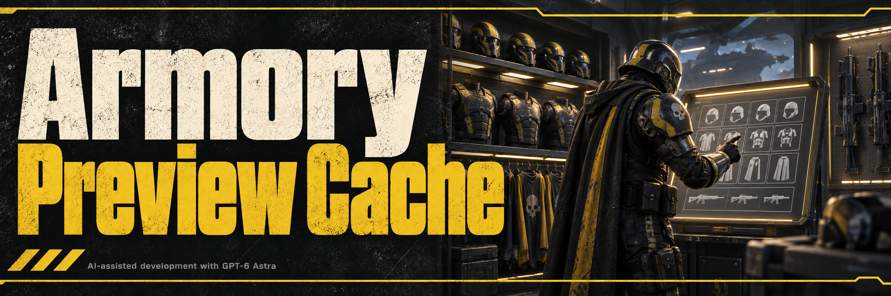

> Release **v23** for Steam build 25480438 / EXE 1.8.46015.0. Offline checks passed; caching works in live play. New in v23, checked offline: a short visit keeps the thumbnails of the tiles it showed once they have rendered.

- **Faster repeat visits:** Reuses completed equipment thumbnails instead of waiting for native regeneration each time you switch tabs or reopen a menu.
- **Broader coverage:** Applies to helmets, armor, capes, primary weapons, secondary weapons and throwables, including Armory pre-select screens and mission briefing's overview and equipment pickers.
- **Earlier asset loading:** Preloads equipment packages and weapon attachments, prioritizing current requests and recently viewed equipment.
- **Learned startup preparation:** Remembers recently viewed equipment between launches so its assets can start loading earlier; first-time previews still need native rendering.
- **Session image cache:** Keeps rendered thumbnails when leaving and reopening menus, within memory limits; rendered images are rebuilt after restarting the game.
- **Original presentation:** Keeps the game's equipment appearance, thumbnail quality and live character preview.

Release **v23** skips the thumbnail work on frames where nothing it uses changed; measured in live play the mod costs 0.017 ms per frame in missions and 0.040 ms on the ship, depending on the screens open. Requires Bingus Shared Loader v18 or newer. Routine diagnostics are off by default; developers can set `CowboyBingusDiagnostics = true` before initialization to enable them.

Current version: **v23**, for game build **25480438**. See [changes](CHANGELOG.md) and [validation coverage](docs/MIGRATION_VALIDATION.md).

**AI disclosure:** Claude Opus 5.5 assisted with research, implementation, tests and documentation.

## License

Zero-Clause BSD (0BSD): use, copy, modify and distribute for any purpose, with no conditions. See `LICENSE`.
